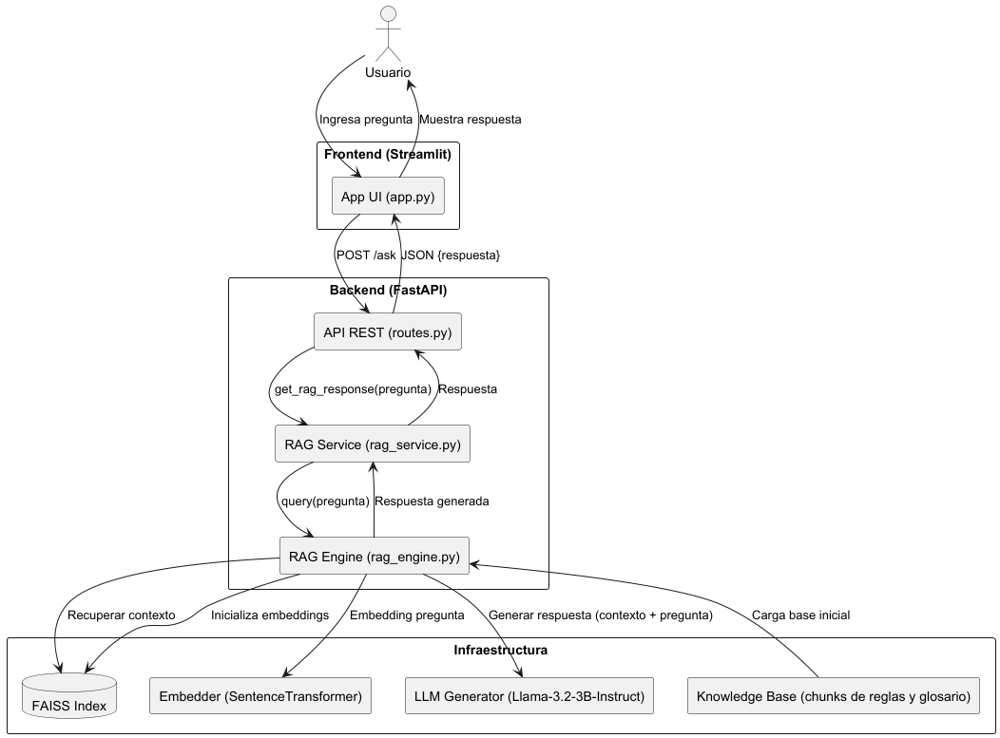

# RAG Chatbot with Streamlit + FastAPI

This project implements a chatbot based on the RAG (Retrieval-Augmented Generation) architecture, composed of:

- **Frontend:** Streamlit
- **Backend:** FastAPI
- **Embeddings:** SentenceTransformers (`multilingual-e5-large`)
- **Vector Store:** FAISS
- **Generation:** Generic LLM model (`Llama-3.2-3b`)

---

## 📊 Architecture Diagram



---

## 📁 Project Structure

```
chatbot_project/
├── backend/
│   ├── app/
│   │   ├── api/
│   │   │   └── routes.py
│   │   ├── domain/
│   │   │   └── rag_engine.py
│   │   ├── services/
│   │   │   └── rag_service.py
│   │   ├── data/
│   │   │   └── knowledge_base.txt
│   │   └── main.py
│   ├── Dockerfile
│   └── requirements.txt
├── frontend/
│   ├── app.py
│   ├── Dockerfile
│   └── requirements.txt
├── docker-compose.yml
├── run_chatbot.sh
└── README.md
```

---

## 🚀 Installation and Execution

### Prerequisites

- Docker
- Docker Compose

### Quick Start

Run the provided shell script to automatically build and launch the backend and frontend containers:

```bash
./run_chatbot.sh
```

This script will:

1. Build the backend image and start it on port `8000`.
2. Build the frontend image and start it on port `8501`.
3. Automatically link both containers so the frontend can access the backend.

Then, access the UI at: [http://localhost:8501](http://localhost:8501)

Alternatively, you can run the containers manually:

```bash
# Backend
docker build -t rag-backend ./backend
docker run -d -p 8000:8000 rag-backend

# Frontend (after backend is up)
docker build -t rag-frontend ./frontend
docker run -d -p 8501:8501 --link rag-backend rag-frontend
```

### Connecting the Frontend to the Backend

- The frontend now correctly connects to the backend using the service name `backend` defined in `docker-compose.yml`. Ensure the backend URL in the frontend is:
  ```python
  http://backend:8000/question
  ```
- Make sure to define the correct endpoint based on your API prefix, if any.

### Debugging Connectivity Issues

If you encounter connectivity issues between containers:
1. Test the backend endpoint from the Frontend container:
   ```bash
   docker exec -it chatbot-umpe-frontend-1 curl -X POST -H "Content-Type: application/json" -d '{"question": "Test"}' http://backend:8000/question
   ```
2. Ensure that both containers are up and running:
   ```bash
   docker ps
   ```
3. If you update code, rebuild images and restart the containers with:
   ```bash
   docker-compose down --rmi all
   docker-compose up -d --build
   ```

---

## 📄 Technical Details

- **Backend** exposes `POST /question` endpoint which receives a user question and returns a generated answer.
- **RAGEngine** handles embeddings and context retrieval via FAISS.
- **LLM** uses `distilgpt2` via `transformers.pipeline`.
- **CORS Setup:** The backend has been configured to allow requests from any origin using the FastAPI CORS middleware.

---

## 📊 Architecture Diagram

See [`architecture_diagram.puml`](.docs/architecture_diagram.puml)

---

## 🧠 Knowledge Base

Located at `backend/app/data/knowledge_base.txt`. You can replace it with any domain-relevant content.

---

## 🛠️ Dependencies

Installed automatically via Docker. For manual setup:

```bash
cd backend
pip install -r requirements.txt
```

For the frontend:
```bash
cd frontend
pip install -r requirements.txt
```

---

## ✍️ Credits

Final project - Master UM - Language Models Workshop.

- **Martin Levy:** [@wuzimu-dev](https://github.com/wuzimu-dev)
- **Juan Andrés Gossweiler:** [@jagoss](https://github.com/jagoss)

---

## 📌 Repository Link

Find the complete repository on GitHub: [chatbot-umpe](https://github.com/jagoss/chatbot-umpe)
